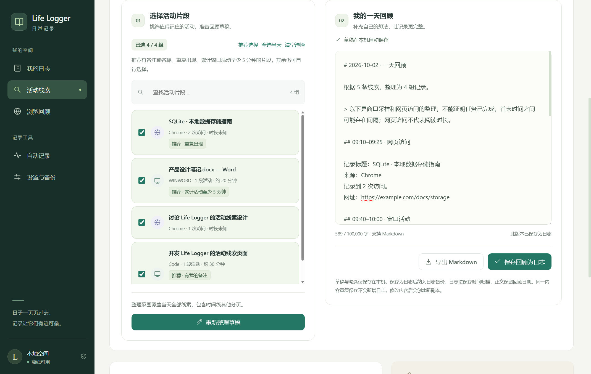

# Life Logger

一个本地优先的桌面日志工具，使用 Electron、React 和 TypeScript。日志、语音转写与浏览统计均在本机处理。

> **开发中 · Early Preview**：这是一个仍在迭代的个人项目，目前提供源码构建和本地运行方式，尚无正式安装包。现有能力可以体验，但记录细节、兼容性与交互仍会继续完善。

## 界面预览

以下截图使用示例数据，不包含真实个人日志或浏览记录。




## 当前阶段

已实现本地日志、语音录入、活动采样、活动线索与可编辑的一天回顾。网页线索可选择在后台自动补充；回顾会按本地规则推荐片段并准备草稿，每晚可自动保存当天线索回顾。目前不会根据活动自动推断完成了哪些任务。

后续方向：完善线索整理与日常回顾、优化采集体验、补充设备兼容性验证，以及提供安装包与更新流程。欢迎通过 Issues 提交问题与建议。

## 功能

- **我的日志**：直接书写、语音录入、草稿自动保留；按本地日期分组；全文搜索、来源筛选、日历跳转和历史分页。
- **活动线索**：按天回看窗口标题与每次网页访问；可开启每 15 分钟自动补充当天网页，展示最近同步、新增数量和读取失败信息。支持搜索、来源筛选、备注、忽略与恢复，以及保存为日志。未保存的备注草稿按线索自动保留，现有活动会自动迁移为线索。
- **一天回顾**：合并当天重复的窗口或页面，推荐有名称、备注、重复出现或持续至少 5 分钟的活动；首次查看自动准备可编辑草稿，已有正文和勾选会保留。支持保存为日志和导出 Markdown。
- **浏览回顾**：统计最近 24 小时、7 天或 30 天的本地浏览历史，展示网站排行与高频页面，支持保存为日志。读取失败或记录截断时明确提示。
- **自动记录**：可选的 Windows 前台进程与窗口标题采样；周期摘要与每日线索回顾分别调度，每晚回顾包含已采集的网页和个人备注。停用、锁屏、休眠和闲置时结束当前会话。
- **设置与备份**：配置应用排除规则、标题采集和原始活动保留期限；导出全部日志；恢复前自动创建当前日志的安全副本。

## 安装与启动

环境：Node.js >= 20、npm >= 10。前台活动采集目前仅支持 Windows；浏览器历史支持系统中对应的 Chromium 系浏览器配置。

```bash
npm install
npm run rebuild:native
npm run build
npm start
```

`better-sqlite3` 必须使用与 Electron 匹配的原生二进制。首次安装或升级 Electron 后运行 `npm run rebuild:native`，需要联网获取匹配版本；若没有对应预编译包，需要系统 C++ 编译工具。

开发模式：

```bash
npm run dev
```

开发模式使用本地开发服务器。`npm start` 直接加载构建好的本地页面，不需要开发服务器。主进程代码修改后需要重新启动开发进程。

## 本地语音

把 `ggml-base.bin` 放入应用数据目录下的 `whisper-models` 文件夹：

- Windows：`%APPDATA%/life-logger/whisper-models/ggml-base.bin`
- macOS：`~/Library/Application Support/life-logger/whisper-models/ggml-base.bin`
- Linux：`~/.config/life-logger/whisper-models/ggml-base.bin`

模型可从 Whisper.cpp 的公开模型库获取。语音使用 AudioWorklet 录制单声道音频，每段最长 5 分钟；转写在后台工作线程中进行。转写结果追加到当前草稿，确认后再保存。没有模型时文字记录和其他功能仍可正常使用。

## 自动记录

在侧栏“设置与备份”中开启采集。默认关闭，启用后可配置：

- 10–600 秒的采样间隔。
- 周期摘要间隔，0 表示关闭；首次启用即开始计时。
- 每晚总结时间，可单独关闭；按当天已采集的线索自动保存完整回顾，范围截止生成时刻。在窗口活动采集或网页自动补充任一开启时生效；空数据不会创建日志。当日超过设定时间打开应用会补生成，不补以前日期，重启不会重复保存当日总结。
- 网页线索自动补充，默认关闭。开启后立即读取当天 Chromium 系浏览器访问，随后每 15 分钟去重补充；与窗口采集开关独立。锁屏、休眠时暂停，设置变化或停用后废弃在途结果；读取失败显示原因并稍后重试。浏览器读取在后台进行，不阻塞窗口采样。
- 是否记录窗口标题、排除哪些进程。
- 原始活动保留期限，默认不自动清理。选择保留期限后，任一自动采集运行时每天清理过期活动和未批注线索；修改期限会立即重新检查。有自定义名称或备注的线索、已保存日志会保留。
- 开机自动启动及开机启动时收起到托盘。登录项仅在安装后的应用中生效。

关闭主窗口会收起到托盘；在托盘菜单选择“退出”会结束会话并保存状态。应用只允许一个实例。活动时长是采样估计，不等同于精确工作时长；闲置 5 分钟后暂停。

## 使用活动线索

1. 在“设置与备份”开启后台活动采集与窗口标题采集。之后前台窗口会自动成为线索；旧记录中没有采集的标题无法补回。
2. 打开“活动线索”，选择日期。窗口线索显示采样估计时长，并可展开查看完整标题和时间。
3. 点击“补充网页线索”，读取这一天的 Edge、Chrome、Brave、Chromium 本地历史；或在设置中打开“自动补充网页线索”，后台定期补充当天访问。应用排除规则同样适用，无痕浏览和已删除历史无法补回。历史日期仍需手动补充。
4. 为线索补充名称或备注，再保存为日志；重复点击不会重复创建。输入中的名称和备注按线索自动保留，切换日期、筛选、页面或重新启动后可继续编辑；保存备注后清理草稿，点击“取消”会丢弃草稿。草稿读取或写入失败会明确提示，请先保存备注。保存的日志是当时的副本，之后修改线索备注不会自动更改日志。无用线索可以忽略，并在“查看已忽略”中恢复。

网页线索按每次访问保存；同一天重复补充会去重。页面标题来自读取时浏览器保存的标题，可能与访问当时不同。每个浏览器配置每天最多读取最近 5000 次访问，截断或读取失败会明确提示。网页访问不等于持续阅读，窗口标题也不能证明任务已完成。


## 整理一天回顾

在“活动线索”中选择日期，再切换到“一天回顾”：

1. 自动整理当天全部未忽略线索，不受时间线的搜索、来源筛选或分页限制。相同标题与来源的记录会合并；自定义名称不同的片段保持独立。
2. 首次打开且没有本机草稿时，自动选择推荐片段并准备草稿。推荐理由会显示在片段旁；没有推荐时可自行勾选或全选。“推荐选择”只调整勾选，不改正文。可以搜索片段或清空选择，筛选不会取消其他已选片段。
3. 草稿可自由修改，并按日期自动保存在本机。自动刷新、新增线索、加载中输入或主动清空都不会覆盖当前正文和勾选；重新整理会先显示预览，确认后才替换当前编辑内容。
4. 保存为日志，或导出为 Markdown 文件。同一天相同内容重复保存不会新增日志；修改后保存会创建新的副本，不覆盖已有日志。已删除或被直接修改的日志不妨碍重新保存回顾。

窗口时长会裁剪到所选日期，并去除重叠时间；首末时间之间的空隙不会计入时长。网页访问没有阅读时长。回顾采用本地规则整理记录依据，个人名称与备注单独列出，不自动推断任务完成情况。

草稿和勾选不包含在日志备份中，需保存为日志或导出文件。日志按实际保存时间归档，回顾日期保留在正文中。


## 数据与恢复

日志数据库为应用数据目录中的 `life-logger.db`，自动化配置在 `activity-settings.json`。草稿单独保存在本机界面存储中。

JSON 备份包含所有来源的日志。活动线索和备注需先保存为日志才会纳入备份；未保存的线索、原始活动、草稿和自动化设置不包含在内。恢复前先校验文件；确认恢复时会在 `userData/recovery/` 创建安全副本，再以事务替换日志。恢复结果会显示副本位置。原始活动、线索及备注与设置不会被替换；恢复后清除线索与旧日志的关联，允许重新保存。

浏览器历史只读，通过后台线程处理。“浏览回顾”只返回聚合统计；“活动线索”会在手动补充或开启自动补充后，将访问线索存入本地数据库。网址仅保留 HTTP(S) 的域名与路径，移除账号、密码、查询参数和片段；标题与路径仍可能包含个人信息。不采集截图、键盘输入、页面正文或对话正文。推荐与回顾均使用本地规则，不发送到云端。日志默认没有额外加密，应使用系统账户和磁盘权限保护。

## 验证

```bash
npm run typecheck
npm test
npm run build
npm run test:desktop
```

- 单元测试覆盖备份类型、日期、音频编码、摘要、采集生命周期和线索网址处理。
- 桌面测试启动隐藏 Electron 窗口，使用项目 `.test-artifacts/` 下的全新数据目录。
- 桌面测试验证真实 SQLite 增删改查、历史筛选、备份往返、安全副本、设置与界面交互，并生成多页面预览。
- 草稿测试覆盖保存中切页、后续新输入保护、线索备注跨筛选与重新加载恢复、取消清理和存储失败提示；恢复测试覆盖后台日志并发写入。
- 活动线索测试使用真实 SQLite 与模拟 Chromium 历史库，覆盖逐次访问、去重、排除规则、旧数据迁移、跨日边界、分页、批注保留、重复保存和备份关联。
- 录音测试使用 Chromium 虚拟麦克风；浏览器界面测试使用固定示例数据，不访问个人麦克风或浏览器历史。预览图中的日记内容同样是示例，不会写入用户数据库。
- 一天回顾测试覆盖跨日与重叠时长、整天分组、选择范围、草稿跨页面保留与日期隔离、替换预览、重复保存、Markdown 导出和备份。
- 智能整理测试覆盖推荐边界、首次自动草稿、主动空稿与加载中输入保护；自动化测试覆盖周期、排除规则、锁屏/停用弃结果、不阻塞采样、夜间完整回顾和重启幂等。桌面测试的自动网页 worker 同样使用模拟历史库。
- 模型实际识别质量、真实设备权限、系统锁屏事件及开机启动仍需对应设备环境验证。

## 目录

```text
apps/desktop/electron/       主进程、preload、活动管理器和后台线程
apps/desktop/scripts/        构建、启动、原生模块重建与桌面测试
apps/desktop/src/components/ 日志编辑器、时间线、日历和功能页面
apps/desktop/src/audio/      AudioWorklet 录音与 WAV 编码
packages/domain/            领域类型与统一界面 API
packages/shared/            本地日期工具
packages/storage/           SQLite 存储、搜索和事务恢复
packages/capture/           浏览器历史与 Windows 前台窗口采集
packages/ai/                本地转写与统计摘要
packages/sync/              日志备份格式与校验
```

Electron 主进程与 preload 由 esbuild 打包到 `dist-electron/*.cjs`，前端由 Vite 构建到 `dist/`。原生模块保持外部依赖。当前提供本地构建和启动流程，尚不包含安装包签名及自动更新。
